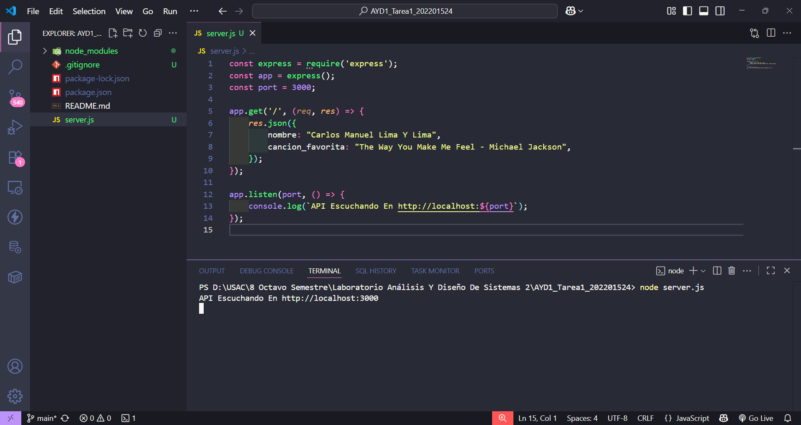

# Tarea 1

Fecha: 14 de agosto de 2025
Status: Completado

# Datos Estudiante

| Nombre | Carlos Manuel Lima y Lima |
| --- | --- |
| Registro Académico | 202201524 |

# Crear una API REST que muestre tu nombre y el nombre de tu canción favorita.

# Generar un tag de versión release-1.0 para marcar esta versión inicial.

# Crear una rama hotfix para corregir un error: en lugar de mostrar la canción favorita, la API debe mostrar el nombre del álbum favorito.

# Generar un tag de versión release-2.0 para marcar esta corrección.

# Eliminar la rama hotfix después de haber realizado y versionado el cambio.

